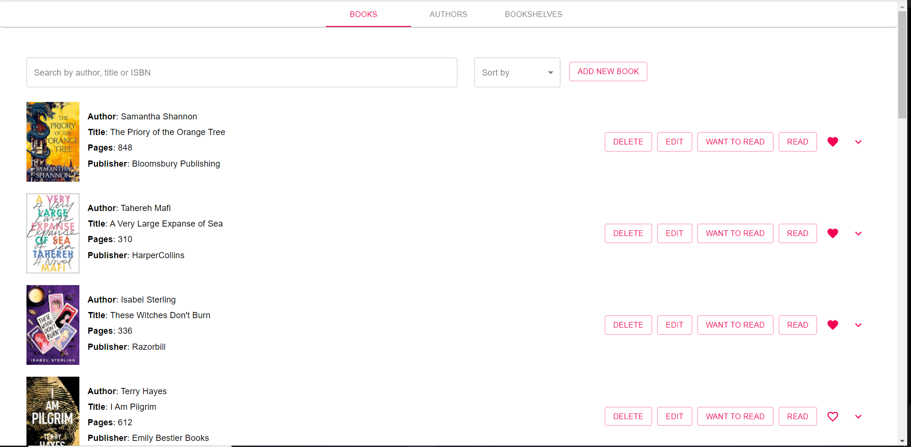
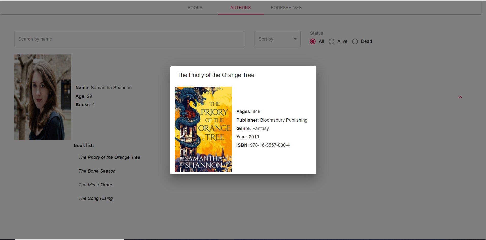
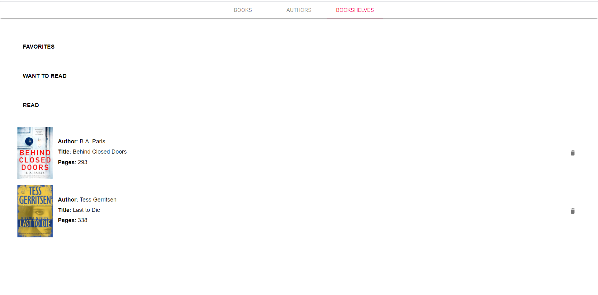

### LIBRARY PROJECT

Web application made with:
* React
* React-Redux
* Redux-Thunk
* Redux Api Middleware
* Normalizr
* Material-UI
Final project for Univerisity course - Frontend Development.

To run an API just type npm run json-server in your terminal.

